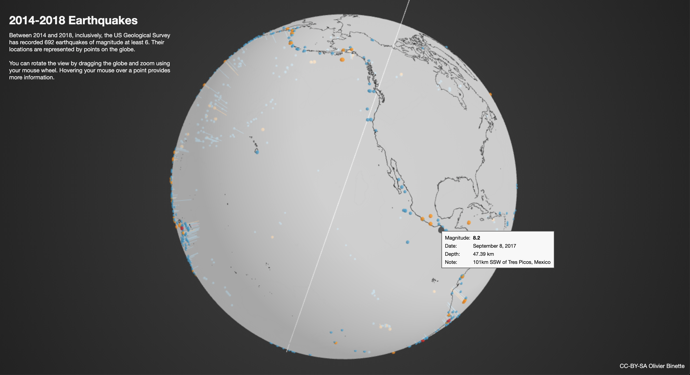

# Earthquakes
3D data visualization with WebGL/three.js

Visualization of earthquakes of magnitude greater than 6 from January 1st 2014 up to January 1st 2019. Data is from the US Geological Survey (usgs.gov). See also [this blog post about it](https://mathstatnotes.wordpress.com/2019/01/06/3d-data-visualization-in-webgl-three-js/), where I discuss the original motivation (visualizing spherical multidimensional scaling).

Interact with it [here](https://olivierbinette.ca/earthquakes).

